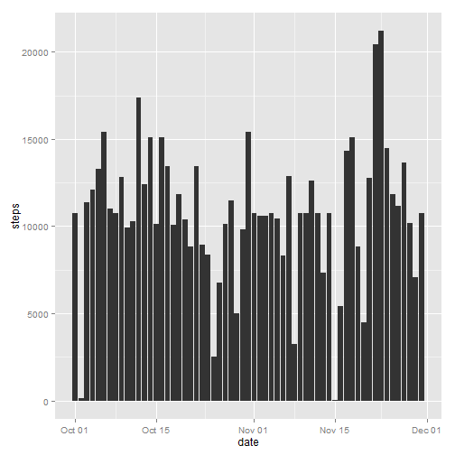

<!-- rmarkdown v1 -->
## Loading and preprocessing the data

The data is already provided with the repository. You only need to load the data. This code chunk will also convert the date column into the date format and create a new object called "cleandata" with the complete cases to make calculations without missing values possible.


```r
#load the data
data <- read.csv("activity.csv")
#convert the date
data$date <- as.Date(data$date, "%Y-%m-%d")
#clean the data and store it in a new object
cleandata <- data[complete.cases(data),]
```

We will need the ggplot2 and the gridExtra package for the following plots. **Make sure you have ggplot2 installed. If not, install it by using install.packages("ggplot2"). Otherwise the plots will not work on your machine.**

Assuming you have installed ggplot2, this code chunk will load the packages.


```r
#load ggplot2
library(ggplot2)
```

## What is mean total number of steps taken per day?

Calculating the mean and median of steps per day, we first need to sum up the steps per day.


```r
#calculate the sum per day
stepsum <- sapply(split(cleandata$steps, cleandata$date), sum)
#calculate the mean of steps per day
meanstepsum <- mean(stepsum)
#calculate the median of steps per day
medianstepsum <- median(stepsum)
```

The mean of steps per day is 10766.2 and the median is 10765.

This is a plot of the steps per day. As we can see, there is some data missing as well as some dates only have a few steps.


```r
#create a barchart
qplot(date, steps, data=cleandata, geom="bar", fun.y=sum, stat="summary")
```

 


## What is the average daily activity pattern?

To get a picture of the average daily activity pattern, we create a time time series plot of the 5-minute interval and the average number of steps taken, averaged across all days.


```r
#plot a line chart
qplot(interval, steps, data=cleandata, geom="line", fun.y=mean, stat="summary")
```

 

As we can clearly see, there is an maximum in the morning. To get the exact interval, we need to get this maximum and the corresponding interval.


```r
#calculate the mean for every interval
stepmean <- sapply(split(cleandata$steps, cleandata$interval), mean)
#get the maximum
maxstepmean <- max(stepmean)
#find the corresponding interval for the maximum
max_step_interval <- stepmean[stepmean == maxstepmean]
```

The maximum number of steps averaged across all days is taken in the **835 interval.**

## Imputing missing values

As we saw in the first barplot, there seems to be some major flaws within the data as some dates have no data or only few. Let's calculate the number of rows with incomplete cases also known as missing values.


```r
#calculate the number of rows with missing data
row_with_na <- nrow(data[!(complete.cases(data)),])
```

There are 2304 rows with missing values.

To fill those dates with values, we will take the corresponding mean of that interval to replace the missing values. We will then create a new dataset with the missing data filled in


```r
#create new object with orginal data
filled_data <- data

for(i in 1:length(filled_data$steps)) {
        if(is.na(filled_data[i,1])){
                x <- as.character(filled_data[i,3])
                filled_data[i,1] <- stepmean[x]
        }      
}
```

Let's have a look at the data with the imputed missing values.


```r
#create a barchart
qplot(date, steps, data=filled_data, geom="bar", fun.y=sum, stat="summary")
```

 


```r
#calculate the sum per day
stepsum2 <- sapply(split(filled_data$steps, filled_data$date), sum)
#calculate the mean of steps per day
meanstepsum2 <- mean(stepsum2)
#calculate the median of steps per day
medianstepsum2 <- median(stepsum2)
```

The mean of steps per day for the new dataset is 10766.2 and the median is 10766. The mean and median from the clean dataset without the imputed values were 10766.2 for the mean and 10765 for the median.

As we can see, the mean is the same but the median has changed by -1. Imputing missing values have no effect on the mean, because we replaced the missing value with the mean. No new values here. Only the median has slightly changed. 

## Are there differences in activity patterns between weekdays and weekends?

To see the difference between weekdays and weekend, we first need to add a factor that indicates wheter that date belongs to the weekend or not.

**Note:** This will only work for english systems. If you run machine with a diffrent language setting for your operating system, please change your language to english. Otherwise it will not work.


```r
weekend <- c("Saturday", "Sunday")

for(i in 1:length(cleandata$date)) {
        if(weekdays(cleandata$date[i]) %in% weekend){cleandata$weekdaytype[i] <- "weekend"}
        if(!(weekdays(cleandata$date[i]) %in% weekend)){cleandata$weekdaytype[i] <- "weekday"}
}
```

Once we have that factor variable, we can plot the mean of steps per day for weekdays and weekend.


```r
qplot(interval, steps, data=cleandata, geom="line", fun.y=mean, stat="summary", facets= . ~ weekdaytype)
```

 

As we can see, the patterns differ substantially between weekdays and weekend.
